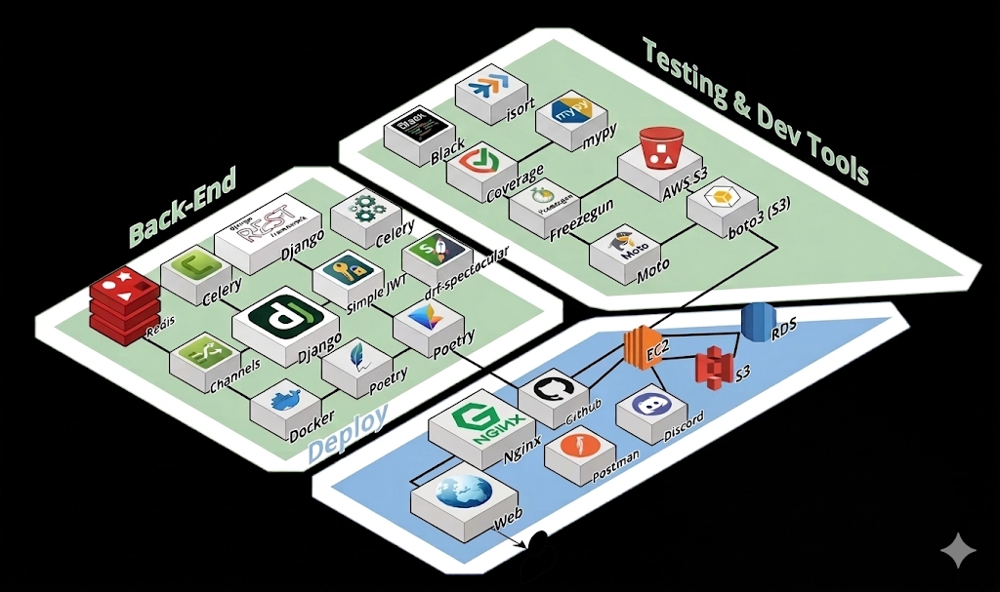

# 👨🏻‍🏫 통합 교육 플랫폼(LMS) 개발 프로젝트
<br>

---

## 📖 프로젝트 소개

>  본 프로젝트는 분산된 교육 운영 도구와 비효율적인 학습 관리 환경을 개선하기 위해 통합 교육 플랫폼(LMS) 개발을 목표로 선정되었습니다. 기존 교육 과정에서는 과제, 평가, 커뮤니케이션이 개별 도구로 분리되어 있어 운영 복잡도와 관리 비용이 지속적으로 증가하고 있었습니다. 이에 학습자·강사·관리자가 하나의 플랫폼에서 학습 진행 현황과 데이터를 일관되게 관리할 수 있는 환경을 구축하고자 했습니다. 본 기획은 실제 교육 운영 흐름을 반영한 기능 중심 설계를 통해 사용성과 확장성을 확보하는 데 중점을 두었습니다. 또한 향후 콘텐츠 확장과 데이터 기반 학습 분석이 가능한 구조를 마련하는 것을 핵심 기획 의도로 삼았습니다.

<br>

---

## 🗓️ 프로젝트 기간
- 2026년 3월 5일 - 2026년 4월 1일
<br>

---

## 🧰 사용 스택




<br>

---

## 1팀
# 👥팀 동료

| 프로필                                                        | GitHub                                     | 이름 |
|------------------------------------------------------------|--------------------------------------------|----|
|      | [@SUNO-Back](https://github.com/SUNO-Back) | 순현오 |
|     | [@wooryun](https://github.com/wooryun)            | 고건 |

---
<details>
<summary><strong>🧑‍🎓 유저 및 수강 관리 서비스(User & LMS)</strong></summary>

<br>

- **보안 중심의 인증 시스템**
    - JWT 기반 인증을 이용한 보안 인증 체계 구축
    - 소셜 로그인을 이용한 사용자 접근성 향상 및 Callback프로세스 최적화
    - 다중인증을 이용한 통합 인증 시스템구축
- **사용자 경험 및 이력 관리**
    - 유연한 프로필관리를 통해 닉네임 중복검사 및 실시간 정보 변경 기능제공.
    - 기수별 수강 신청 프로세스 및 개인별 수강 목록 조회기능으로 학습이력 최적화
    - 회원탈퇴 시 즉시 삭제가 아닌 14일의 유예 기간을 두는 논리 삭제 방식을 적용하여 데이터 복구 및 오남용 방지
- **질의응답 상세 조회**
    - 질문 내용, 작성자 정보, 조회수
    - 답변 및 답변 댓글 목록

</details>

<br>

<details>
<summary><strong>🛠️ 어드민 및 데이터 분석 서비스</strong></summary>

<br>

- **운영 효율화 워크플로우**
    - 권한 기반 관리를 이요해 어드민 전용 페이지를 통해 회원정보 수정, 삭제 및 상세 권한 설정 기능
    - 수강 신청 요청에 대한 승인/거절 워크플로우를 자동화하여 관리 편의성 증대.
    - 탈퇴 데이터 관리를 하여 유예기간내 탈퇴 취소 및 상세 내역 조회를 통한 사용자 이탈을 방지.
- **데이터 기반 인사이트 제공**
    - 회원가입, 탈퇴, 수강 등록 추이를 월별 / 사유별로 분석하는 통계 API구축.
    - 프론트엔드 대시보드 구성을 위한 정데된 분석 데이터 제공.

</details>


<br>

---

## 2팀
# 👥팀 동료

| 프로필                                                         | GitHub                                     | 이름  |
|-------------------------------------------------------------|--------------------------------------------|-----|
|        | [@jun2k5](https://github.com/jun2k5)                   | 김병준 |
|     | [@unkn0wn-j](https://github.com/unkn0wn-j)                   | 김지원 |
|  | [@dodzn89-cell](https://github.com/dodzn89-cell)                   | 정상운 |
|     | [@whdgk7176](https://github.com/whdgk7176) | 박종하 |

---

<details>
<summary><strong>💬 쪽지시험(User)</strong></summary>

<br>

#### 📝 시험 목록
* **시험 목록 조회** → 진행 상태(done / pending)필터링 지원  
* **시험 정보 제공** → 과목, 시험명, 문제 개수, 총점, 제한시간 포함  
* **응시 여부 확인** → 제출 여부(is_done), 점수 및 정답 개수 제공   
* **페이징 기반 조회** → page, has_next구조

---

#### 📝 시험 응시
* **시험 참가 코드 입력** -> 코드 검증 후 응시 가능
* **응시 가능 조건 검증** -> 배포 상태, 시간(open_at / close_at), 코호트 소속 여부 확인
* **응시 제한 처리** -> 미오픈 / 종료 / 권한없음 / 코드 불일치 예외 처리
* **Redis 기반 인증 상태 저장** -> 검증 성공 시 TTL 기반 접근 허용

---

#### 📝 시험 문제 풀이
* **시험 문제 조회** -> 객관식, 주관식, OX, 순서, 빈칸 등 다양한 타입 지원
* **문제 스냅샷 기반 제공** -> 시험 시점 기준 문제 유지
* **사용자 답안 입력 구조 제공**
* **시험 진행 정보 포함** -> 경과 시간(elapsed_time), 부정행위 횟수

---

#### 📝 시험 상태 관리
* **시험 상태 조회** -> activated / closed 상태 반환
* **강제 제출 여부 판단** -> 시간 초과 / 종료 시 force_submit = true 
* **유요한 응시 세션 검증**

---

#### 📝 시험 제출 및 채점
* **시험 제출** -> 답안 리스트 기반 제출
* **자동 채점 처리** -> 점수(score), 정답 개수 계산
* **중복 제출 방지** -> 이미 제출 시 예외 처리
* **결과 페이지 이동 URL제공**

---

#### 📝 시험 결과 확인
* **시험 결과 상세 조회**
* **문제별 정답 / 제출 답안 / 정오 여부 제공**
* **해설(explanation)제공**
* **시험 메타 정보 제공** -> 총점(total_score), 정답 수, 경과 시간, 제출 시간


</details>

<br>

<details>
<summary><strong>🛠 쪽지시험 관리(Admin)</strong></summary>

<br>

#### 📁 시험 관리
* 시험 생성 -> 제목, 과목, 썸네일 이미지 업로드
* 시험 목록 조회 -> 검색 / 정렬 / 페이징 지원
* 시험 상세 조회 -> 문제 리스트 및 정답 포함
* 시험 수정 -> 제목, 과목, 이미지 변경
* 시험 삭제 -> 시험 데이터 제거

---

#### 📋 문제 관리
* 문제 등록 -> 다양한 문제 타입 지원
* 문제 수정 -> 문제 내용, 정답, 배점 수정
* 문제 삭제 -> 시험 내 문제 제거
* 문제 유효성 검증 -> 총 배점 제한 / 문제 수 제한 체크

---

#### 💬 시험 배포 관리
* 시험 배포 생성 -> 시험 + 코호트 매핑
* 배포 목록 조회 -> 검색 / 필터 / 정렬 지원
* 배포 상세 조회 -> 응시 인원, 평균 점수 포함
* 배포 수정 -> 시험 시간, 제한 시간 변경
* 배포 상태 ON/OFF -> 활성화 / 비활성화
* 배포 삭제

---

#### 💬 응시 관리
* 응시 내역 목록 조회 -> 시험, 코호트, 유저 기준 검색
* 웅시 내역 상세 조회 -> 문제별 답안 및 채점 결과 확인
* 응시 데이터 삭제 -> 잘못된 제출 데이터 제거

---

#### 💬 통계 및 분석
* 배포별 통계 제공 -> 제출 수, 평균 점수
* 기수별 평균 점수 조회 API활용
* 시험 응시 데이터 기반 성과 분석
* 과정 / 과목(User)
* 과정 (Course)
* 과정 목록 조회 -> 과정 이름, 태그, 썸네일 이미지 제공
* 사용자 권한 기반 조회 -> 인증된 사용자만 접근 가능
* 과정별 학습 진입 포인트 제공

---

#### 💬 과목(subject)
* 과목 목록 조회 -> 과정별 과목 리스트 제공
* 과목 정보 제공 -> 과목명, 학습 기간, 썸네일 포함
* 과목 상태 관리 -> 활성화 여부(status) 기반 노출
* 시험과 연계 -> 과목 단위로 시험(쪽지시험) 연결

---

#### 💬 과정 / 과목 관리(Admin)
* 과정 관리 (Course)
* 과정 생성 -> 이름, 태그, 설명, 썸네일 등록
* 과정 수정 -> 정보 변경 및이미지 수정
* 과정 삭제 -> 과정 및 관련 데이터 제거
* 과정 유효성 검증 -> 중복 태그 및 필수값 체크

---

#### 💬 과목 관리(SubJect)
* 과목 생성 -> 과정에 속한 과목 생성
* 과목 목록 조회 -> 과정별 과목 관리
* 과목 상태 관리 -> 활성화 / 비활성화
* 과목 수정 -> 기간, 시간, 썸네일 변경
* 과목 중복 방지 -> 동일 이름 과목 생성 제한


</details>


<br>

---

## 3팀
# 👥 팀 동료


| 프로필                                                         | GitHub                                           | 이름  |
|-------------------------------------------------------------|--------------------------------------------------|-----|
|       | [@sangbo](https://github.com/tkdqh57)            | 심상보 |
|      | [@gyu](https://github.com/gyugyu99)              | 이규빈 |
|  | [@Brandon-Hyun](https://github.com/Brandon-Hyun) | 현동익 |
|       | [@pcw8233](https://github.com/pcw8233)           | 박철우 |


<br>

# 🤖Qna, AI챗봇 기능

<details>
<summary><strong>❓ 1. 질문 (Question)</strong></summary>

<br>

- **질문 등록 / 수정**
    - 제목, 내용(Markdown), 이미지, 대·중·소 카테고리
- **질의응답 목록 조회**
    - 답변 여부 탭, 카테고리 필터, 검색
    - 최신순 정렬, 페이지네이션, 카드 UI
- **질의응답 상세 조회**
    - 질문 내용, 작성자 정보, 조회수
    - 답변 및 답변 댓글 목록

<br>
</details>

<details>
<summary><strong>✅ 2. 답변 (Answer)</strong></summary>

<br>

- **답변 등록 / 수정**
    - Markdown 작성, 이미지 첨부
- **답변 채택**
    - 질문자 본인만 가능
    - 질문당 1개 답변 채택
- **답변 댓글 작성**
    - 최대 500자로 내용 제한

<br>
</details>

<details>
<summary><strong>🧠 3. AI 답변 (AI Chatbot)</strong></summary>

<br>

- **질문 등록 시 AI 최초 답변 자동 생성**
- **AI 답변 노출**: 모든 사용자에게 동일하게 노출
- **추가 질문**: AI 답변 기반 연속 채팅(Follow-up) 제공
- **실시간 응답**: SSE(Server-Sent Events) 기반 실시간 타이핑 효과
- **접근 권한**: 로그인 사용자만 채팅 가능

<br>
</details>

<details>
<summary><strong>🖇️ 4. 카테고리</strong></summary>

<br>

- **카테고리 관리**
- 계층형 구조
  - 대분류 > 중분류 > 소분류 최대 3단계 계층 구조로 관리됩니다.
  - API 응답 시 해당 카테고리의 현재 계층과 상위 카테고리를 포함한 전체 경로를 배열 형태로 제공합니다.
- 유연한 필터링 및 분류
  - 질문 등록 시 필수 지정을 하여 특정 카테고리에 배정되어야 하며, API요청 시 category_id를 통해 관리됩니다.
  - 사용자는 대/중/소분류 중 원하는 단계의 카테고리를 선택하여 관련 질문들만 필터링하여 조회할 수 있습니다.
- 데이터 연동 및 확장성
  - 질의응답 기능 전반에 걸쳐 카테고리 ㄹ정보가 연동되며, 상세 조회 시 질문의 제목, 내용과 함께 카테고리 정보가 명확히 노출됩니다.
  - 추후 새로운 과정이나 과목이 추가되더라도 시스템 구조의 변경없이 카테고리를 동적으로 확장할 수 있도록 설계되었습니다.

<br>
</details>

---

## 4팀
# 👥 팀 동료

| 프로필 | GitHub | 이름 |
|--------|--------|------|
|  | [@Justman-yzz](https://github.com/Justman-yzz) | 김태준 |
|  | [@PJG8806](https://github.com/PJG8806) | 박진규 |
|  | [@SuyeongUeno](https://github.com/SuyeongUeno) | 장수영 |
|  | [@HHJina](https://github.com/HHJina) | 황현진 |

# 📌 주요 기능

<details>
<summary><strong>💬 커뮤니티 (User)</strong></summary>

<br>

#### 📝 게시글
* **게시글 작성** → 제목, 내용(Markdown), 이미지, 카테고리  
* **게시글 조회** → 첫 번째 이미지 presigned URL 변환 및 썸네일 제공  
* **게시글 상세조회** → Markdown 내 파일/이미지 URL → presigned URL 변환  
* **게시글 수정 (본인)** → 파일 변경/삭제 시 DB & S3 동기화  
* **게시글 삭제 (본인)** → 게시글 삭제 시 S3 파일도 함께 삭제  

---

#### 💬 댓글
* **댓글 작성** (최대 300자)
* **유저 태그** (@닉네임)
* **댓글 목록 조회** (무한 스크롤)
* **댓글 수정** (본인 / 관리자)
* **댓글 삭제** (본인 / 관리자)

</details>

<br>

<details>
<summary><strong>🛠 커뮤니티 관리 (Admin)</strong></summary>

<br>

#### 📁 카테고리 관리
* 카테고리 등록 / 조회 / 수정 / 삭제
* 카테고리 활성화 ON/OFF
* 비활성 카테고리만 삭제 가능
* 카테고리 삭제 시 게시글 연쇄 삭제
* 삭제 시 2단계 확인 (세션 TTL 활용)

---

#### 📋 게시글 관리
* 게시글 목록 조회 (검색 / 필터 / 정렬)
* 게시글 노출 여부 ON/OFF
* 게시글 상세 조회 / 수정 / 삭제
* 이미지 / 첨부파일 / 댓글 인라인 확인

---

#### 💬 댓글 관리
* 게시글별 autocomplete 기반 댓글 조회
* 댓글 상세 조회
* 태그된 유저 정보 확인
* 부적절한 댓글 삭제

</details>

# 📜 4팀의 프로젝트 규칙

## Code Convention
- View / Service / Serializer 분리
- SNAKE_CASE / CamelCase 사용
- 상수화 및 중복 제거
- DB 중심 처리
- 비즈니스 로직은 Service에서 처리
- 에러 응답 형식 통일 (error_detail)
- 매직넘버 → 상수화

## Communication Rules
- Discord 활용
- 정기 회의 진행
- 불참 하루 전 공유
- AI 하루 최대 5회 제한
- 공용 파일 수정 시 공지
- 에러/수정사항 기록

# 📚 Documents
- [응답코드 예시](https://hongong.hanbit.co.kr/http-%EC%83%81%ED%83%9C-%EC%BD%94%EB%93%9C-%ED%91%9C-1xx-5xx-%EC%A0%84%EC%B2%B4-%EC%9A%94%EC%95%BD-%EC%A0%95%EB%A6%AC/)
- [정규표현식](https://fhaktj8-18.tistory.com/entry/%ED%8C%8C%EC%9D%B4%EC%8D%AC-%EC%A0%95%EA%B7%9C%ED%91%9C%ED%98%84%EC%8B%9D-%EA%B8%B0%EC%B4%88%EC%99%80-%EC%98%88%EC%A0%9C-%EC%82%B4%ED%8E%B4%EB%B3%B4%EA%B8%B0#google_vignette)

---
# 📁프로젝트 구조

```
├── apps/                   # 비즈니스 로직 (Domain Driven Design 적용)
│   ├── core/               # 공통 유틸리티 및 베이스 클래스
│   ├── chatbot/            # [핵심] LLM 연동 및 상담 챗봇
│   │   ├── prompts/        # 프롬프트 엔지니어링 관리
│   │   ├── services/       # 챗봇 비즈니스 로직 (비동기 처리 등)
│   │   └── tasks.py        # Celery 비동기 작업
│   ├── community/          # 커뮤니티(게시판/댓글) 및 알림(Signals)
│   ├── exam/               # 시험 콘텐츠 및 성적 관리
│   ├── questions/          # Q&A 게시판 로직
│   ├── subject/            # 교육 과목 관리
│   └── users/              # 사용자 인증 및 권한 관리
│
│   ※ 모든 App은 가독성과 유지보수를 위해 Views, Serializers, 
│      Services, Tests를 폴더 단위로 분리하여 관리합니다.
│
├── config/                 # 프로젝트 설정 (Celery, ASGI/WSGI, 환경별 Settings)
├── .github/                # CI/CD 및 협업 템플릿 (GitHub Actions)
├── Dockerfile              # 운영 환경 컨테이너화
└── pyproject.toml          # Poetry 의존성 관리
```

---
<br>

# 📘 프로젝트 규칙 (Project Rules)

## 🌿 Git Workflow & Convention

### 1.⏳ Git Flow

기본적으로 다음과 같은 브랜치들을 사용합니다.
```
- main/: 제품의 배포 가능한 최종 상태를 저장하는 브랜치
- develop/: 개발 중인 기능을 통합하는 브랜치
- feature/: 새로운 기능 개발을 위한 브랜치
- fix/: 버그를 수정하는 브랜치
- refactor: 리팩토링을 위한 브랜치
- hotfix/: 운영 중인 서비스의 긴급 수정 사항을 처리하는 브랜치
```    
- 기본 브랜치: `main`, `develop`
- `main`, `develop` 직접 push **금지**
- 모든 PR은 최소 **1인 이상 승인 필수**

<br>

### 2. ✏️ Git Commit Convention

 - **🧱 기본 구조** : ` <type>(#이슈번호): <작업 요약> `
 - **✅ 예시** :
   - `✨feat(#10): 시험 모델 추가`
   - `🐛fix(#32): 마이그레이션 오류 수정`
   - `♻️refactor(#78): 시험 조회 로직 리팩터링`
   - `📝docs(#51): README 구조 업데이트`
     
<details>
<summary><strong> 📐 Commit Template </strong></summary><br>

```

### 아래 1번 문항부터 주석 문구가 빈줄에 주석을 지우고 문항에 대한 내용을 작성하고 커밋을 완료해주세요.

# 1. 아래 형식에 맞춰 커밋 메시지 타이틀을 작성하세요:
# <이모지> <타입>: <간결한 커밋 메시지 요약>
#
# 예시:
# ✨ feat: 사용자 로그인 기능 추가
# 🐛 fix: 댓글 생성 시 발생하는 NullPointerException 수정
# 💡 chore: 불필요한 로그 제거 및 변수명 수정
# 🎨 style: black, isort 코드 포매터 실행
# 📝 docs: README에 프로젝트 설명 추가
# 🚚 build: Dockerfile 수정하여 실행 오류 해결
# ✅ test: 게시글 API 단위 테스트 추가
# ♻️ refactor: 중복 코드 제거 및 함수 분리
# 🚑 hotfix: 프로덕션 장애 수정 - 잘못된 URL 패턴 수정

# 2. 변경 또는 추가사항을 아래에 간략하게 작성하세요 ( 필수 )
#
# 본문 내용은 어떻게 변경했는지 보다 무엇을 변경했는지 또는 왜 변경했는지를 설명합니다.

# 3. 이슈가 있다면 아래에 연결하세요 ( 선택 )
#
# 예시
# 관련 이슈: #123

```
</details>

 -   **🔖 Commit Type 정의 → gitmoji**
   
<div align=center> 
  
| 깃모지 |    타입    | 설명                           |
| :-: | :------: | :--------------------------- |
|  ✨  |   feat   | 새로운 기능 추가                    |
|  🐛 |    fix   | 버그 수정                        |
|  💡 |   chore  | 기능 추가 없이 코드 수정 (오타, 주석 등)    |
|  🎨 |   style  | 코드 포매팅 수정                    |
|  📝 |   docs   | 문서 수정 (README 등)             |
|  🚚 |   build  | 빌드 관련 파일 수정                  |
|  ✅  |   test   | 테스트 코드 추가/변경 (프로덕션 코드 변경 없음) |
|  ♻️ | refactor | 리팩터링 (기능 변화 없음)              |
|  🚑 |  hotfix  | 긴급 수정                        |

</div>
  
  
## 🧑🏻‍💻 Code Convention

**1. 🧠 네이밍 규칙**
- **파일명**:  snake_case
- **클래스명**:  PascalCase
- **함수명**:  snake_case
-  **상수**:  UPPER_SNAKE_CASE

<br>

**2. 📍 URL 매핑 규칙**
- `Trailing Slash`는 추가하지 않는다

<br>

**3. ✨ Code Formatting**
- black
- isort
- mypy
- 위 세 가지를 사용하여 코드 포매팅과 타입 어노테이션을 준수한다.
<br>

**4. 🧪 Test Code**
- Django 내부에 포함된 `TestClient`를 활용하여 테스트코드를 작성한다.
- Coverage 80% 이상을 유지한다.
<br>

**5. 🏷️ Swagger 문서**
- Swagger 문서 자동화를 위한 라이브러리로 `drf-spectacular`를 사용한다.
- `extend_schema` 데코레이터를 사용하여 스키마를 구성하고 각 API 별 태깅, API 요약, 구체적인 설명, 파라미터 등을 지정한다.
  - Tag는 해당 API가 해당되는 요구사항 정의서의 카테고리 명을 사용
  - Summary에 해당 API의 요약 설명을 기재
  - Description에 해당 API의 구체적인 동작 설명

<br>

---


## :clipboard: Documents

> [ 🧚 요구사항 정의서 ](https://docs.google.com/spreadsheets/d/1CGE8X8weUpm9_qwQ6y2K7XwTwmZT8ON9R7tRCC7NzDc/edit?gid=0#gid=0)
> 
> [ 🪄 API 명세서 ](https://docs.google.com/spreadsheets/d/1x6AFgjoFvBZPOV8gF-BhMxeUJuaNVXu9HwMqg-Pzrs8/edit?gid=0#gid=0)
>
> [ 🔦 테이블 명세서 ](https://docs.google.com/spreadsheets/d/1Mg9SHZd3RzX7g1vJOsU0xzBo1hzCNZ_JH0Hf1YrD_5w/edit?gid=673456509#gid=673456509)
>
